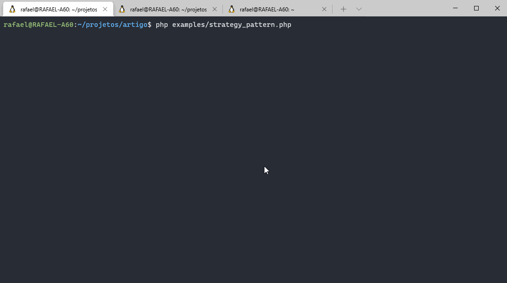

# Diferentes estratégias de log utilizando Strategy Pattern com PHP

Um exemplo prático de utilização do padrão de projeto **Strategy Pattern** com PHP, através da criação de uma biblioteca para registro de **logs** utilizando diferentes estratégias.

## Requisitos

- Composer
- PHP 8.0 ou superior
- MySQL ou MariaDB

## Configuração

- Utilizar o Composer para instalar dependências e gerar autoload das classes;

    ```shell´
    composer update
    ```

- Editar o arquivo [examples/config/database.php](examples/config/database.php) com as informações de acesso no banco de dados.

- Executar o [script.sql](script.sql) para criação da tabela de logs;

## Utilização

Abrir o terminal na raiz do projeto e rodar os exemplos.

```shell´
php examples/strategy_pattern.php
```


## Mais informações

https://rafaelcouto.com.br/diferentes-estrategias-de-log-utilizando-strategy-pattern-com-php